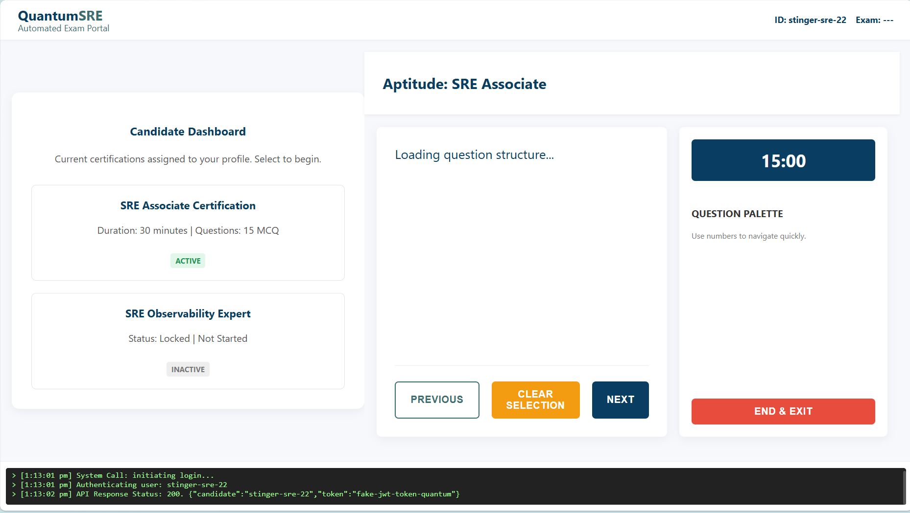
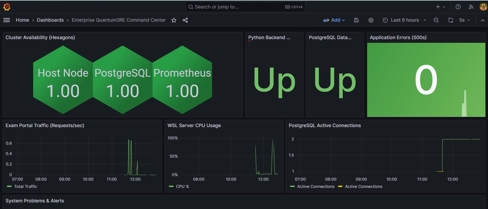
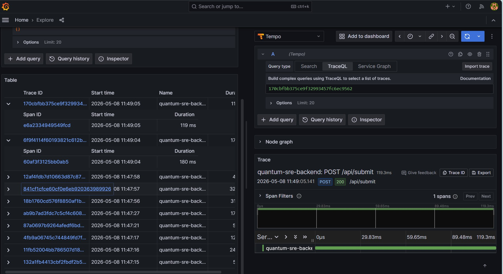
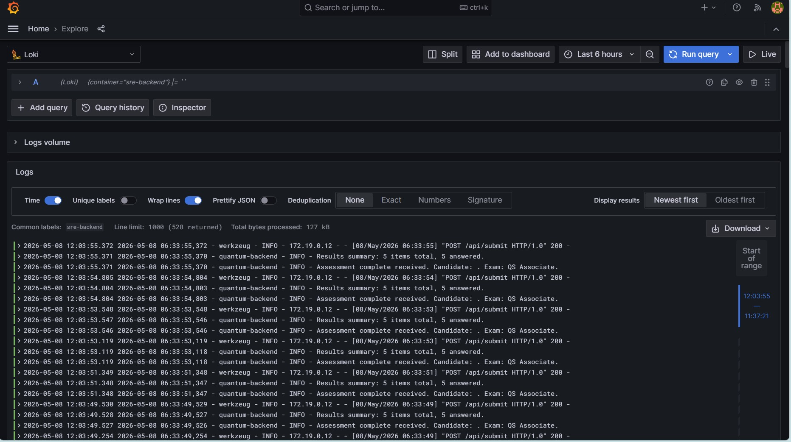

# 🚀 QuantumSRE: Unified Observability & Telemetry Stack

A production-grade, containerized SRE observability platform designed to monitor distributed applications using the **RED** (Rate, Errors, Duration) and **USE** (Utilization, Saturation, Errors) methodologies. 

This project simulates a highly-available "Automated Exam Portal" backend, injecting Chaos Engineering faults to demonstrate real-time telemetry alerting, distributed tracing, and centralized log aggregation.

## 🏗️ Architecture & Tech Stack
This platform implements the **Three Pillars of Observability**: Metrics, Logs, and Traces, entirely provisioned as code.

* **Application Stack:** Python (Flask), PostgreSQL, Nginx, Docker Compose
* **Metrics Pipeline:** Prometheus, Telegraf (Postgres), Node Exporter (Host), OpenTelemetry Collector
* **Log Aggregation:** Grafana Loki, Promtail
* **Distributed Tracing:** Grafana Tempo, OpenTelemetry Auto-Instrumentation
* **Visualization:** Grafana (Provisioned via Code), Polystat (Honeycomb topology)

---

## 🖥️ 1. The Application: QuantumSRE Exam Portal
The target application is a custom-built Exam Portal. It includes an interactive UI and a backend API that processes test submissions and records them in a PostgreSQL database. It features built-in fault injection to simulate production outages (500 Internal Server Errors) for telemetry validation.



---

## 📊 2. Enterprise SRE Command Center (Metrics)
A unified Grafana dashboard built using Dashboard-as-Code provisioning. It utilizes the Polystat plugin to create a Honeycomb topology map for instant visual health checks of the host node, database, and telemetry pipeline. It actively tracks API request rates, CPU utilization, and database connection saturation.



---

## 🕸️ 3. Distributed Tracing (Traces)
By utilizing OpenTelemetry and Grafana Tempo, the platform maps the exact micro-second journey of a request. The waterfall chart below demonstrates the trace of a `POST /api/submit` request, breaking down the exact latency (119.3ms) across the backend services.



---

## 📜 4. Centralized Log Aggregation (Logs)
Promtail tails the Docker container logs in real-time and ships them to Loki. This allows for rapid querying of high-cardinality data. Below is a query filtering specifically for the `sre-backend` container, capturing the application's INFO and ERROR logs alongside the Nginx proxy access logs.



---

## 🚀 How to Run Locally

1. Clone the repository:
   ```bash
   git clone [https://github.com/your-username/sre-observability-stack.git](https://github.com/your-username/sre-observability-stack.git)
   cd sre-observability-stack